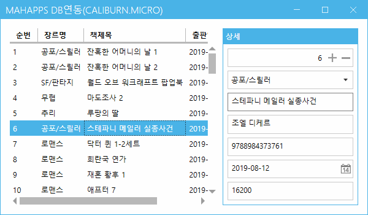
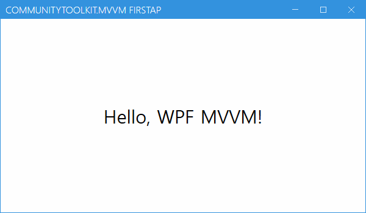
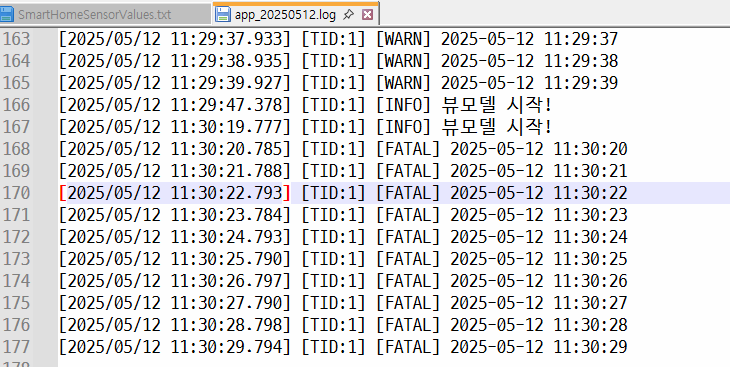
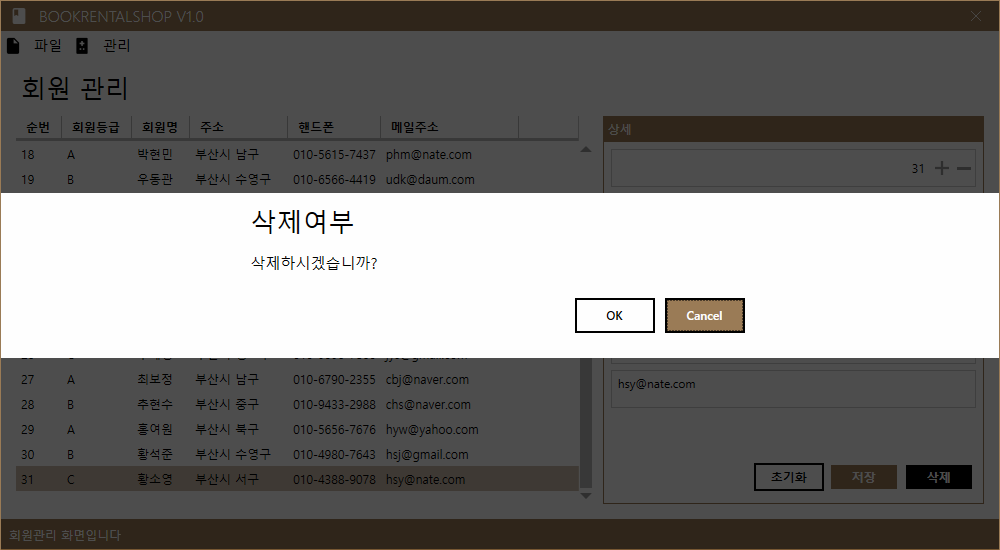
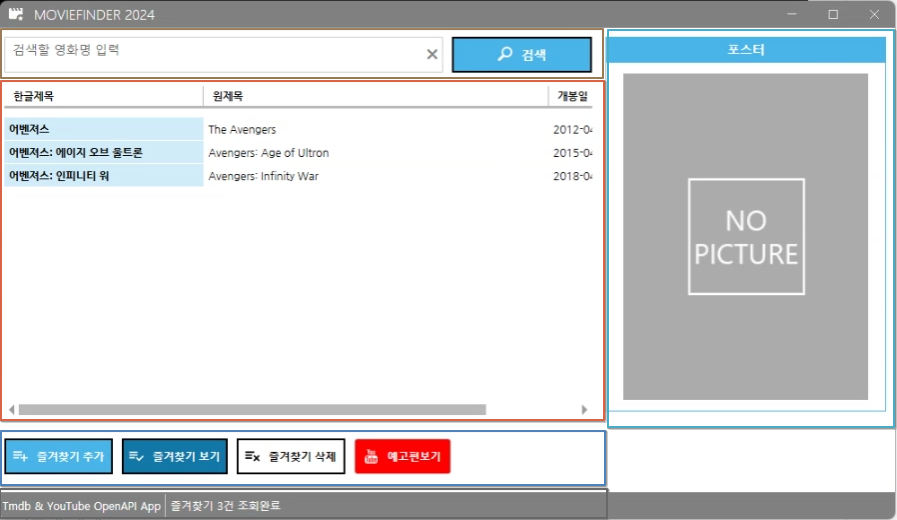

# iot-wpf-2025
IoT 개발자 WPF 학습리포지토리

## 1일차

### WPF 개요
- Windows Presentation Foundation
    - WinForms 디자인의 미약한 부분, 속도개선, `개발과 디자인의 분리` 개선하고자 MS 프레임워크
    - 화면 디자인을 XML 기반의 xaml
    
### WPF DB바인딩 연습
1. 프로젝트 생성 - [소스](./day01/Day01Wpf/WpfBasicApp01/MainWindow.xaml), [소스](./day01/Day01Wpf/WpfBasicApp01/MainWindow.xaml.cs)
2. MahApps.Metro(디자인) 라이브러리 설치
3. 디자인
    - App.xaml
    - MainWindow.xaml
    - MainWindow.xaml.cs의 기반 클래스를 변경하는 것 - 디자인
4. UI구현
5. DB연결 사전준비
    - Nuget -> MySQL.Data 라이브러리 설치
6. DB연결
    1. DB연결 문자열 (ConnStr) : DB 종류마다 연결문자열 포맷이 다르고 무조건 있어야함
    2. 쿼리 : 실행할 쿼리
    3. 데이터를 담을 객체 : 리스트 형식
    4. DB연결객체(`SqlConnection`) : 연결 문자열을 처리하는 객체. DB연결, 끊기, 연결확인...
        - DB종류별로 MySqlConnection, SqlConnection, OracleConnection...
    5. DB명령객체(`SqlCommand`) : 쿼리를 컨트롤 하는 객체
        - ExecuteReader() : SELECT문 실행, 결과 데이터를 담는 메서드
        - ExecuteScalar() : SELECT문 중 count() 등 함수로 1row/1column 데이터만 가져오는 메서드
        - ExecuteNonQuery() : INSERT, UPDATE, DELETE문과 같이 transaction이 발생하는 쿼리실행 사용 메서드
    6. DB데이터어댑터(`SqlDataAdapter`) : 연결이후 데이터처리를 쉽게 도와주는 객체
        - DB명령객체처럼 쿼리를 직접실행할 필요없음
        - DataTable, DataSet 객체에 Fill() 메서드로 자동으로 채워줌
    7. DB데이터리더(`SqlDataReader`)
        - DataReader : ExecuteReader()로 가져온 데이터를 조작하는 객체
        - DataAdapter : 좀 더 간단하게 데이터를 처리해주는 객체
7. 실행결과

    

8. MahApps.Metro 방식 다이얼로그 처리

    

9. 여기까지 개발한 방식은 전통적인 C# 윈앱개발과 차이가 없음

### WPF MVVM
- 디자인 패턴
    - 소프트웨어 공학에서 공통적으로 발생하는 문제를 재사용 가능하게 해결한 방식
    - 반복적으로 되풀이되는 디자인의 문제를 해결하도록 맞춤화 시킨 설계양식
    - 여러 디자인패턴 중, 디자인과 개발을 분리해 개발할 수 있는 패턴을 준비
        - MV* : MVC, MVP, MVVM ...

- MVC : Model View Controller 패턴
    - 사용자 인터페이스(View) 와 비즈니스 로직(Controller, Model) 분리해서 앱 개발

    

- MVP : Model-View-Presenter 패턴
    - MVC 패턴에서 파생됨
    - Presenter : Supervising Controller 라고 부름

- MVVM : Model-View-ViewModel 패턴
    - MVC 패턴에서 파생됨
    - 마크업언어로 GUI코드를 구현하는 아키텍쳐
    - 사용자는 View로 접근(MVC와 차이점)
    - Model은 당연히 DB요청, 응답
    - 연결방식이 MVC와 다름
    - 전통적인 C#방식은 사용자가 이벤트를 발생시킬 때 콜백이 일어났었다면
    - MVVM 방식은 프로세스가 변화를 주시하고 있어야 함, 상태가 바뀌면 변화를 바로 줄 수 있게

    

- MVVM 장단점
    - View <-> ViewModel 간 데이터 자동 연동
    - 로직 분리로 구조가 명확해짐
    - 팀으로 개발시 역할분담이 확실, 팀프로젝트에 알맞음
    - 테스트와 유지보수는 쉬움
    - 구조가 복잡. 디버깅이 어려움
    - 스케일이 커짐

### WPF MVVM 연습
1. 프로젝트 생성 - [디자인](./day01/Day01Wpf/WpfBasicApp02/View/MainWindow.xaml) [소스](./day01/Day01Wpf/WpfBasicApp02/ViewModel/MainViewModel.cs)
2. PF DB바인딩 연습시 사용한 UI 복사
3. Model, View, ViewModel 폴더 생성
4. MainWindow.xaml을 View 폴더로 이동
5. App.xaml StartupUri 수정
6. Model 폴더 내 Book클래스 생성
    - INotifyPropertyChanged 인터페이스 : 객체내의 어떠한 속성값이 변경되면 상태를 프로세스에게 알려주는 기능
7. ViewModel폴더 내 MainViewModel클래스 생성
    - INotifyPropertyChanged 인터페이스 구현
    - OnPropertyChange 이벤트 핸들러 메서드 코딩
8. MainView.xaml에 ViewModel 연결
    ```xml
    ...
    xmlns:vm="clr-namespace:WpfBasicApp02.ViewModel"
    DataContext="{DynamicResource MainVM}"
    ...
    <mah:MetroWindow.Resources>
        <vm:MainViewModel x:Key="MainVM" />
    </mah:MetroWindow.Resources>
    ```
9. MainView.xaml 컨트롤에 바인딩 작업
    - 전통적인 C# 방식 : x:Name 으로 이름 할당 후 이벤트 기반
    ```xml
    <!-- UI 컨트롤 구성 -->
    <DataGrid x:Name="GrdBooks" 
            Grid.Row="0" Grid.Column="0" Margin="5" 
            AutoGenerateColumns="False" IsReadOnly="True" 
            MouseDoubleClick="GrdBooks_MouseDoubleClick">
        <DataGrid.Columns>
            <DataGridTextColumn Binding="{Binding Idx}" Header="순번" />
            ...
    ```

    - WPF + MVVM 바인딩 방식 : ViewModel 이 중계자로서 변화감지, 비동기 느낌의 흐름
    ```xml
    <!-- UI 컨트롤 구성 -->
    <DataGrid Grid.Row="0" Grid.Column="0" Margin="5" 
            AutoGenerateColumns="False" IsReadOnly="True"
            ItemsSource="{Binding Books}"
            SelectedItem="{Binding SelectedBook, Mode=TwoWay}">
        <DataGrid.Columns>
            <DataGridTextColumn Binding="{Binding Idx}" Header="순번" />
            ...
    ```

10. 실행결과

    

## 2일차

### MVVM Framework
- MVVM 개발을 시작하는데 필요한 틀을 짜는데 시간이 많이 소요되며 복잡하다.
- 이를 해소하기 위해 3rd Party 에서 개발한 MVVM 프레임워크 사용
- 종류
    - Prism : MS계열에서 직접 개발. 대규모 앱 개발시 사용. 모듈화 잘 되어 있음. 커뮤니티 활발
        - 진입장벽 높음
    - Caliburn.Micro : 경량화된 프레임워크, 쉽게 개발할 수 있음. Xaml 바인딩 생략가능. 커뮤니티 줄어드는 추세
        - MahApps.Metro에서 사용 중
        - 디버깅이 어려움
        - 다이얼로그 구현 이슈
    - MVVM Light Toolkit : 가장 가벼운 MVVM 입문용, 쉬운 Command 지원, 개발종료.
        - 확장성이 떨어짐
    - **CommunityToolkit.Mvvm** : MS 공식 경량 MVVM. 단순, 빠름. 커뮤니티등 매우 활발
        - 모듈기능이 없음
    - ReactiveUI : Rx 기반 MVVM, 비동기, 스트림처리 강력. 커뮤니티 활발
        - 진입장벽 높음

### Caliburn.Micro
- [공식사이트](https://caliburnmicro.com/)
- [깃허브](https://github.com/Caliburn-Micro/Caliburn.Micro)

### Caliburn.Micro 학습
1. WPF 프로젝트 생성
2. NuGet 패키지 Caliburn.Micro 설치
3. App.xaml StartupUri를 삭제 - [소스](./day02/Day02Wpf/WpfBasicApp01/App.xaml)
4. Models, Views, ViewModels 폴더 생성
5. MainViewModel 클래스 생성 - [소스](./day02/Day02Wpf/WpfBasicApp01/ViewModels/MainViewModel.cs)
     - MainView
     - MainViewModel 과 같이 네이밍 규칙이 엄격함.
6. MainWindow.xaml을 View로 이동
7. MainWindow.xaml을 View 이동
8. Bootstrapper 클래스 생성, 작성 - [소스](./day02/Day02Wpf/WpfBasicApp01/Bootstrapper.cs)
9. App.xaml에서 Resource 추가
10. MahApps.Metro UI 적용

    


### Caliburn.Micro MVVM 연습
1. WPF 프로젝트 생성 - [소스](./day02/Day02Wpf/WpfBasicApp02/ViewModels/MainViewModel.cs)
2. 필요 라이브러리 설치
3. Models, Views, ViewModels로 폴더 생성
4. 이전작업 소스코드 복사, 네임스페이스 변경

    

## 3일차

### CommunityToolkit.Mvvm 다시
1. Wpf프로젝트 생성
2. 필요 라이브러리 설치
    - CommunityToolkit.Mvvm
    - MahApps.Metro
    - MahApps.IconPacks

3. Models, Views, ViewModels 폴더 생성
4. MainWindow.xaml 삭제
5. App.xaml StartupUri 도 삭제
6. View/MainView.xaml 생성
7. ViewModels/MainViewModel.cs 생성

    

### Log 라이브러리
- 개발한 앱, 솔루션의 현재상태를 계속 모니터링하는 기능
- Log 사용법
    - 직접 코딩 방식
    - 로그 라이브러리 사용방식
- Log 라이브러리
    - NLog
    - Serilog : 어려움
    - Log4net
    - ZLogger

### Log 라이브러리 사용
1. NuGet패키지 > NLog, NLog.Schema 설치
2. 새항목 > XML파일 > NLog.config 생성
3. Info < Debug < Warning < Error
4. NLog.config 속성 : 항상복사
5. Debug, Trace는 출력이 안됨
6. Info, Warn, Error, Fatal 을 사용

    

### DB연결 CRUD 연습
1. WPF프로젝트 생성
2. NuGet 패키지 필요라이브러리 설치
    - CommunityToolkit.MvvM
    - MahApps.Metro / MahApps.Metro.IconPacks
    - MySql.Data
    - NLog
3. Models, Views, ViewModels 생성
4. 초기화
5. Mainview.xaml, MainViewModel 메인화면 MVVM 작업
    - 메뉴작업
    - ContentsControl 추가
6. 하위 사용자 컨트롤 작업
    - BookGenre(View, ViewModel)
    - Books(View, ViewModel)
7. Models > Genre(DivisionTbl) 모델 작업
8. BookGenreViewModel DB처리 구현

    

    https://github.com/user-attachments/assets/db1f788e-e9a8-4f0c-98ec-41ec5029b5bb


## 4일차

### DB연결 CRUD 연습(계속)
1. BookGenre에서 INSERT, UPDATE 기능 구현
2. NLog.config 생성
3. Helpers.Common 클래스 생성
    - NLog 인스턴스 생성
    - 공통 DB연결문자열 생성
    - MahApps.Metro 다이얼로그 코디네이터 생성
4. 각 ViewModel에 IDialogCoordinator 관련 코딩 추가
    - ViewModel 생성자에 파라미터 추가
    - View, ViewModel 연동시 IDialogCoordinator 연결
5. View에 Dialog관련 네임스페이스, 속성 추가
6. await this.dialogCoordinator.ShowMessageAsync() 사용

    

7. BookView.xaml 화면작업
8. MemberView.xaml, RentalView.xaml 화면작업
9. ViewModel들 작업

    
    
    

#### DB연결 CRUD 연습시 추가 필요사항
- [x] 여러번 나오는 로직 메서드화
- [x] NLog로 각 기능 동작시 로그남기기. 공통화작업
- [x] 연결문자열 Common으로 이전
- [x] 종료 메뉴 다이얼로그 MetroUI로 변경
- [x] MahApps.Metro 메시지형태로 변경
- [x] 삭제여부 메시지박스 추가

### DB연결 CRUD 실습
- BooksView, BooksViewModel 작업 실습
- 1일차 MVVM 내용, 오늘 학습한것 

## 5일차

### MovieFinder 2025
- 전체 UI : 다섯 영역으로 구분

    

- 영화 즐겨찾기 앱
    - TMDB 사이트에서 제공하는 OpenAPI로 데이터 가져오기
    - 내가 좋아하는 영화리스트 선택, 즐겨찾기 저장
    - 저장된 영화만 리스트업
    - 선택된 영화 더블클릭 > 영화 상세정보 팝업
    - 선택된 영화 선택 > 예고편보기 > 유튜브동영상 팝업

- API / OpenAPI
    - Application Program Interface

- TMDB, Youtube
    - [TMDB](https://www.themoviedb.org/) API 신청
    - [Youtube Data API](https://console.cloud.google.com/)Youtube Data API 신청
        - 프로젝트 생성 후 API 및 서비스 > 라이브러리
        - Youtube Data API 선택
        - 사용버튼 클릭
        - 사용자 인증정보 입력

### 프로젝트 시작
1. WPF 프로젝트 생성
2. NuGet 패키지 사용할 라이브러리 설치
    - CommunityToolkit.Mvvm
    - MahApps.Metro / MahApps.Metro.IconPacks
    - MySql.Data
3. 폴더생성 : Helpers, Models, Views, ViewModels
4. MVVM 구조 초기작업
5. UI 구현

    

6. 로직 구현
    1. TMDB API 사용 구현
    2. 관련 기능 전부구현

7. 데이터 그리드 더블클릭해서 상세정보 표시
    - Nuget 패키지에서 Microsoft.Xaml.Behaviors.Wpf 설치

8. 텍스트박스에서 엔터시 이벤트 발생 처리
9. 텍스트박스 한글 입력 우선 처리
10. 실행 시 텍스트박스에 포커스 가도록 처리
    
    https://github.com/user-attachments/assets/ad1bd648-7c2b-4848-a027-fb16fcca14ff

## 6일차

### MovieFinder 2025 (계속)
1. 상태표시줄 시계 동작
2. 상태표시줄 검색결과 건수 표시
3. 로그 출력 정리


4. 즐겨찾기 DB연동
    1. MySQL Workbench에서 moviefinder 데이터베이스(스키마) 생성
    2. movieitems 테이블생성
    3. INSERT,UPDATE,DELETE 작업
    
    - 시연 영상 (기능 : 즐겨찾기 추가, 삭제, 보기)
    https://github.com/user-attachments/assets/25d90f0c-12a2-4072-9967-5bc8a578c166
