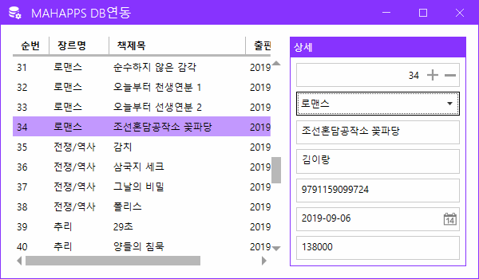

# iot-wpf-2025
IoT 개발자 WPF 학습리포지토리

## 1일차

### WPF 개요
- Windows Presentation Foundation
    - WinForms 디자인의 미약한 부분, 속도개선, `개발과 디자인의 분리` 개선하고자 MS 프레임워크
    - 화면 디자인을 XML 기반의 xaml
    
### WPF DB바인딩 연습
1. 프로젝트 생성 - [소스](./day01/Day01Wpf/WpfBasicApp01/MainWindow.xaml), [소스](./day01/Day01Wpf/WpfBasicApp01/MainWindow.xaml.cs)
2. MahApps.Metro(디자인) 라이브러리 설치
3. 디자인
    - App.xaml
    - MainWindow.xaml
    - MainWindow.xaml.cs의 기반 클래스를 변경하는 것 - 디자인
4. UI구현
5. DB연결 사전준비
    - Nuget -> MySQL.Data 라이브러리 설치
6. DB연결
    1. DB연결 문자열 (ConnStr) : DB 종류마다 연결문자열 포맷이 다르고 무조건 있어야함
    2. 쿼리 : 실행할 쿼리
    3. 데이터를 담을 객체 : 리스트 형식
    4. DB연결객체(`SqlConnection`) : 연결 문자열을 처리하는 객체. DB연결, 끊기, 연결확인...
        - DB종류별로 MySqlConnection, SqlConnection, OracleConnection...
    5. DB명령객체(`SqlCommand`) : 쿼리를 컨트롤 하는 객체
        - ExecuteReader() : SELECT문 실행, 결과 데이터를 담는 메서드
        - ExecuteScalar() : SELECT문 중 count() 등 함수로 1row/1column 데이터만 가져오는 메서드
        - ExecuteNonQuery() : INSERT, UPDATE, DELETE문과 같이 transaction이 발생하는 쿼리실행 사용 메서드
    6. DB데이터어댑터(`SqlDataAdapter`) : 연결이후 데이터처리를 쉽게 도와주는 객체
        - DB명령객체처럼 쿼리를 직접실행할 필요없음
        - DataTable, DataSet 객체에 Fill() 메서드로 자동으로 채워줌
    7. DB데이터리더(`SqlDataReader`)
        - DataReader : ExecuteReader()로 가져온 데이터를 조작하는 객체
        - DataAdapter : 좀 더 간단하게 데이터를 처리해주는 객체
7. 실행결과

    

8. MahApps.Metro 방식 다이얼로그 처리

    

9. 여기까지 개발한 방식은 전통적인 C# 윈앱개발과 차이가 없음

### WPF MVVM
- 디자인 패턴
    - 소프트웨어 공학에서 공통적으로 발생하는 문제를 재사용 가능하게 해결한 방식
    - 반복적으로 되풀이되는 디자인의 문제를 해결하도록 맞춤화 시킨 설계양식
    - 여러 디자인패턴 중, 디자인과 개발을 분리해 개발할 수 있는 패턴을 준비
        - MV* : MVC, MVP, MVVM ...

- MVC : Model View Controller 패턴
    - 사용자 인터페이스(View) 와 비즈니스 로직(Controller, Model) 분리해서 앱 개발

    

- MVP : Model-View-Presenter 패턴
    - MVC 패턴에서 파생됨
    - Presenter : Supervising Controller 라고 부름

- MVVM : Model-View-ViewModel 패턴
    - MVC 패턴에서 파생됨
    - 마크업언어로 GUI코드를 구현하는 아키텍쳐
    - 사용자는 View로 접근(MVC와 차이점)
    - Model은 당연히 DB요청, 응답
    - 연결방식이 MVC와 다름
    - 전통적인 C#방식은 사용자가 이벤트를 발생시킬 때 콜백이 일어났었다면
    - MVVM 방식은 프로세스가 변화를 주시하고 있어야 함, 상태가 바뀌면 변화를 바로 줄 수 있게

    

### WPF MVVM 연습
1. 프로젝트 생성 - [디자인](./day01/Day01Wpf/WpfBasicApp02/View/MainWindow.xaml) [소스](./day01/Day01Wpf/WpfBasicApp02/ViewModel/MainViewModel.cs)
2. PF DB바인딩 연습시 사용한 UI 복사
3. Model, View, ViewModel 폴더 생성
4. MainWindow.xaml을 View 폴더로 이동
5. App.xaml StartupUri 수정
6. Model 폴더 내 Book클래스 생성
    - INotifyPropertyChanged 인터페이스 : 객체내의 어떠한 속성값이 변경되면 상태를 프로세스에게 알려주는 기능
7. ViewModel폴더 내 MainViewModel클래스 생성

## 2일차

## 3일차

